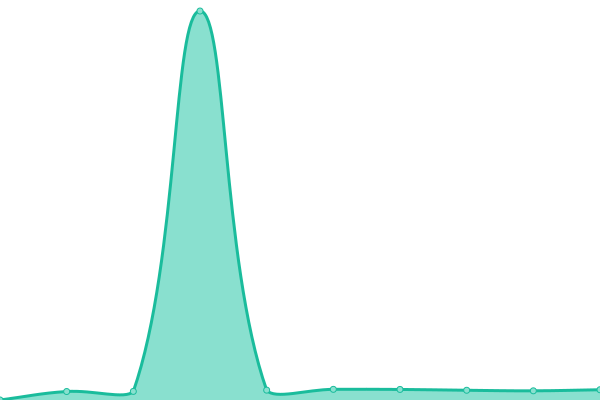

# [📈 即時狀態：](https://hchs-csdc.github.io/CSDC-OJ-Uptime/) <!--live status--> **🟩 所有系統上線中**

本服務使用 [Upptime](https://upptime.js.org) 與 [GitHub Actions](https://github.com/HCHS-CSDC/CSDC-OJ-Uptime/actions) 檢測，並在 [Issues](https://github.com/HCHS-CSDC/CSDC-OJ-Uptime/issues) 與 [GitHub Pages](https://hchs-csdc.github.io/CSDC-OJ-Uptime/) 中顯示即時狀態。

<!--start: status pages-->
<!-- This summary is generated by Upptime (https://github.com/upptime/upptime) -->
<!-- Do not edit this manually, your changes will be overwritten -->
<!-- prettier-ignore -->
| URL | 狀態 | 歷史紀錄 | 回應時間 | 上線率 |
| --- | ------ | ------- | ------------- | ------ |
|  [CSDC OJ](https://csdc.tw) | 🟩 上線中 | [csdc-oj.yml](https://github.com/HCHS-CSDC/CSDC-OJ-Uptime/commits/HEAD/history/csdc-oj.yml) | 

 6834 毫秒
     
 | 

<a href="https://HCHS-CSDC.github.io/CSDC-OJ-Uptime/history/csdc-oj">70.57%</a>
    

|  [CSDC Blog](https://csdc-hchs.blogspot.com/) | 🟩 上線中 | [csdc-blog.yml](https://github.com/HCHS-CSDC/CSDC-OJ-Uptime/commits/HEAD/history/csdc-blog.yml) | 

 378 毫秒
     
 | 

<a href="https://HCHS-CSDC.github.io/CSDC-OJ-Uptime/history/csdc-blog">100.00%</a>
    

|  [HCHS Website](https://www.hchs.hc.edu.tw) | 🟩 上線中 | [hchs-website.yml](https://github.com/HCHS-CSDC/CSDC-OJ-Uptime/commits/HEAD/history/hchs-website.yml) | 

 1457 毫秒
     
 | 

<a href="https://HCHS-CSDC.github.io/CSDC-OJ-Uptime/history/hchs-website">100.00%</a>
    

|  [HCHS PC731](http://research.hchs.hc.edu.tw/~pc731/) | 🟩 上線中 | [hchs-pc-731.yml](https://github.com/HCHS-CSDC/CSDC-OJ-Uptime/commits/HEAD/history/hchs-pc-731.yml) | 

 1722 毫秒
     
 | 

<a href="https://HCHS-CSDC.github.io/CSDC-OJ-Uptime/history/hchs-pc-731">100.00%</a>
    

<!--end: status pages-->

[**前往查看狀態 →**](https://hchs-csdc.github.io/CSDC-OJ-Uptime/)

## 📄 授權條款

- ⚡ by: [Upptime](https://github.com/upptime/upptime) , Edited By [CYTsai](https://github.com/cytsai1008)
- 程式碼使用 [MIT](./LICENSE) 許可授權 © [Upptime](https://upptime.js.org)
- `./history` 中的資料許可: [Open Database License](https://opendatacommons.org/licenses/odbl/1-0/)
